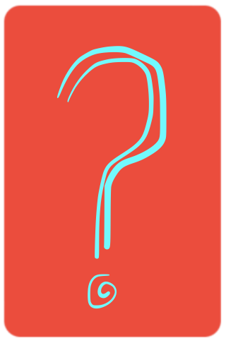
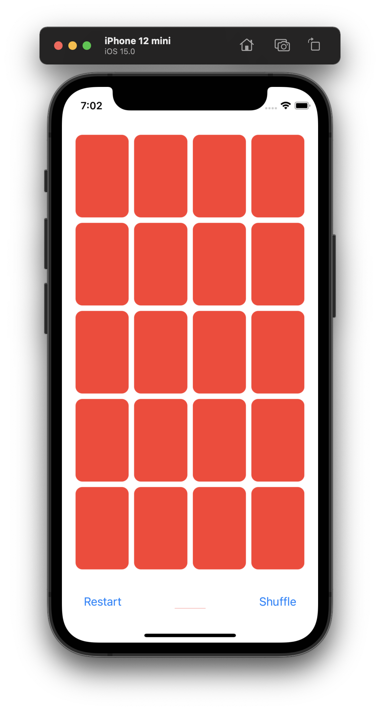
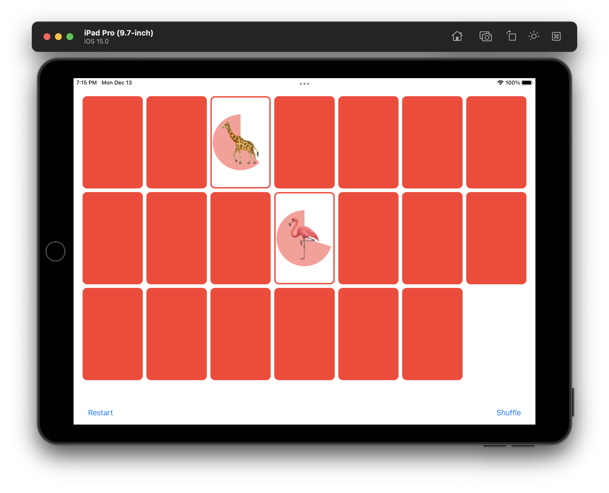

<!-- PROJECT SHIELDS -->


<!-- PROJECT LOGO -->
<br />
<div align="center">
  <a href="https://github.com/ThomasR39/memorise-cs193p">
    
  </a>
  <h3 align="center">Memorise</h3>
  <p align="center">
    A iOS game to test your memory!
    <br />
    <a href="https://github.com/ThomasR39/memorise-cs193p"><strong>Explore the docs »</strong></a>
    <br />
    <br />
    <a href="https://github.com/ThomasR39/memorise-cs193p/tree/main/Memorise/images/demo.gif">View Demo</a>
    ·
    <a href="https://github.com/ThomasR39/memorise-cs193p/issues">Report Bug</a>
    ·
    <a href="https://github.com/ThomasR39/memorise-cs193p/issues">Request Feature</a>
  </p>
</div>

<!-- TABLE OF CONTENTS -->
<details>
  <summary>Table of Contents</summary>
  <ol>
    <li>
      <a href="#about-the-project">About The Project</a>
      <ul>
        <li><a href="#built-with">Built With</a></li>
      </ul>
    </li>
    <li>
      <a href="#getting-started">Getting Started</a>
      <ul>
        <li><a href="#prerequisites">Prerequisites</a></li>
        <li><a href="#installation">Installation</a></li>
      </ul>
    </li>
    <li><a href="#usage">Usage</a></li>
    <li><a href="#roadmap">Roadmap</a></li>
    <li>
      <a href="#contributing">Contributing</a>
      <ul>
        <li><a href="#possible-enhancements">Possible Enhancements</a></li>
      </ul>
    </li>
    <li><a href="#license">License</a></li>
    <li><a href="#acknowledgments">Acknowledgments</a></li>
  </ol>
</details>


<!-- ABOUT THE PROJECT -->
## About The Project




Memorise is a memory game built for my education of Swift. The app was made with the help of the <a href="#acknowledgments"> Stanford CS193P lecture demos. </a> Although the purpose of this app was to learn SwiftUI, I have made this repository public because I think It could be helpful for other Swift beginners.

Some swifty things that Memorise makes use of:
- <a href="https://en.wikipedia.org/wiki/Model%E2%80%93view%E2%80%93viewmodel">MVVM architecture</a>: design pattern that is structured to separate program logic and user interface controls.
- <a href="https://developer.apple.com/tutorials/swiftui/animating-views-and-transitions">Animations and transitions</a>: animate changes to views and to a view’s state.
- <a href="https://docs.swift.org/swift-book/LanguageGuide/Extensions.html">Extensions</a>: add new functionality to existing types and protocols.
- <a href="https://developer.apple.com/documentation/swiftui/geometryreader">Geometry reader</a>: a container view that defines its content as a function of its own size and coordinate space.
- <a href="https://developer.apple.com/xcode/swiftui/">SwiftUI</a>: a framework for building user interfaces for iOS.

### Built With

* [Xcode](https://developer.apple.com/xcode/)
* [SwiftUI](https://developer.apple.com/xcode/swiftui/)
* [Swift](https://github.com/apple/swift)

<!-- GETTING STARTED -->
## Getting Started

### Prerequisites

Memorise was built using Swift 5.5 and Xcode version 13.1

### Installation

Clone this repository and open it in Xcode

```bash
git clone https://github.com/thomasr39/memorise-cs193p.git
cd memorise-cs193p
open -a Xcode Memorise.xcodeproj
```

<!-- USAGE EXAMPLES -->
## Usage

Match the cards on screen by flipping over two cards with the same Emoji. Tapping on the deck of cards at the bottom of the screen will deal the cards onto the screen. After the cards are dealt, the player attempts to match cards by flipping two over. If the flipped cards match,  they disappear.

<!-- ROADMAP -->
## Roadmap

- [x] LICENSE
- [x] README
- [ ] Code comments and documentation
- [ ] Unit tests

See the [open issues](https://github.com/ThomasR39/memorise-cs193p/issues) for a full list of proposed features (and known issues)

<!-- CONTRIBUTING -->
## Contributing

Pull requests are welcome. For major changes, please open an issue first to discuss what you would like to change.

### Possible enhancements

- A scoring system that gives bonus points to the player for matching cards before the pie timer runs out.
- Currently, memorise has a fixed set of emojis to play with. Adding another view for choosing a category of emojis to play with would be good to make the game more dynamic.
- Currently memorise has a fixed number of cards to play with. Adding another view for choosing the number of card pairs to play with would add some flexibility to the game.
- A difficulty system that would determine the number of pairs of cards and time limit.


<!-- LICENSE -->
## License
Distributed under the MIT License. See <a href="https://github.com/ThomasR39/memorise-cs193p/blob/main/LICENCE">LICENSE</a> for more information.

<!-- ACKNOWLEDGMENTS -->
## Acknowledgments

* [Stanford University's 2021 CS193P - Developing Apps for iOS](https://cs193p.sites.stanford.edu/)
